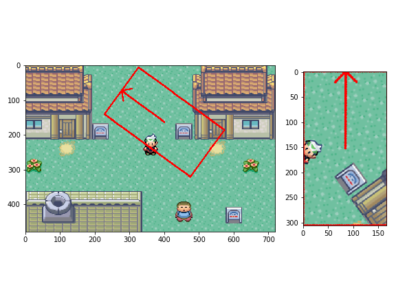

# Rotated_Rectangle_Crop_OpenCV

Author: Lei Mao

Date: 3/2/2018


## Introduction

In OpenCV, cropping a rectangle from an image is extremely easy. However, it does not provide a function to crop a rotated rectangle. Here I developed an algorithm to crop a rotated rectangle from an image, and implemented it as a python function.

## Algorithm

TBD.

## Dependencies

OpenCV 3.0

Python 3.5

## Usage

In Python or Jupyter Notebook:

```Python
from rotated_rect_crop import crop_rotated_rectangle
# image is the image matrix
# rect is the rotated rect object in OpenCV, i.e. (center (x,y), (width, height), angle of clock-wise rotation)
image_cropped = crop_rotated_rectangle(image, rect)
```

## Demo

Generate a random rotated rectangle and crop:

```Shell
python rotated_rect_crop.py
```

